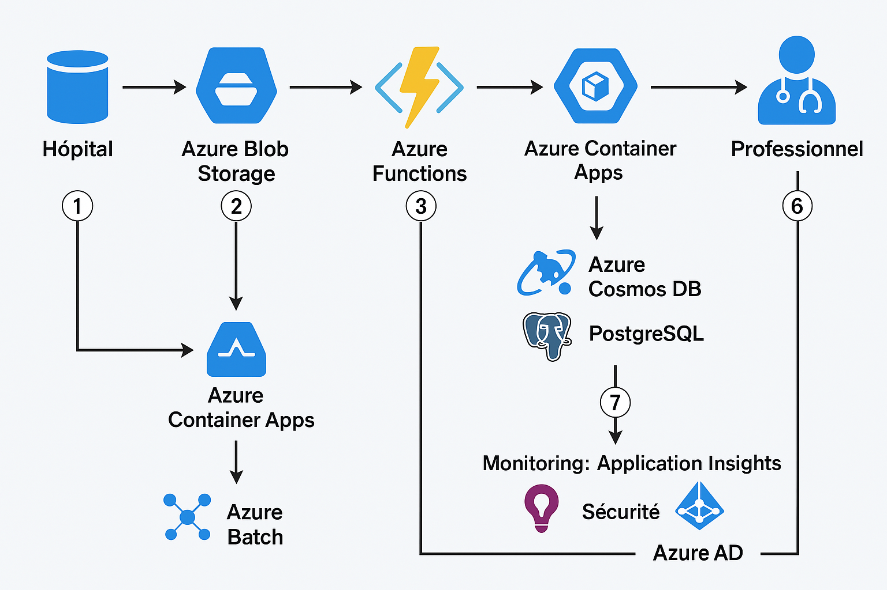

# 🧠 Azure Medical Imaging Platform – Traitement Distribué d’Images Médicales

## 📘 Contexte

Cette plateforme cloud permet le **traitement, l’analyse et la gestion d’images médicales** (radiographies, IRM) envoyées par des hôpitaux. Elle s'appuie sur plusieurs services Azure Compute avancés pour gérer efficacement un grand volume de fichiers, les analyser avec des conteneurs IA, et fournir des rapports de diagnostics via un portail sécurisé.

---

## 🎯 Objectifs

- 📤 Réceptionner des images médicales via un portail web sécurisé
- ⚙️ Déclencher automatiquement un pipeline de traitement :
    - Compression & nettoyage des fichiers
    - Analyse IA via conteneur (ex. TensorFlow)
    - Génération de rapport de diagnostic
- 👩‍⚕️ Permettre aux professionnels de santé d’accéder aux résultats via un portail web
- 🧪 Traiter des milliers d’images en batch pour entraînement IA ou recalcul
- 📈 Mettre en place un monitoring cloud complet (logs, métriques, alertes)

---

## 🧱 Architecture

 

## 🔢 Détails du mécanisme – Étape par étape

### ① Upload par l’hôpital
Le **professionnel de santé** se connecte au **portail web** (hébergé sur Azure App Service).  
Il **téléverse une image médicale** (IRM, radiographie) via un formulaire sécurisé.  
L’image est stockée dans **Azure Blob Storage**.

---

### ② Déclenchement d’Azure Function (Blob Trigger)
Une **Azure Function** est automatiquement déclenchée par l’arrivée du fichier dans le Blob.

Elle :
- Lit les **métadonnées**
- Vérifie le **format / poids / cohérence**
- Prépare les données nécessaires à l’analyse IA

---

### ③ Envoi vers Azure Container Apps pour analyse IA
La Function appelle un **endpoint d’analyse** déployé dans un **Azure Container App** (via HTTP).

Le conteneur :
- Charge un **modèle IA pré-entraîné** (TensorFlow / PyTorch)
- Applique une **compression / nettoyage**
- Effectue l’analyse (détection pathologie, classification)
- Génère un **diagnostic structuré (JSON)**

---

### ④ Enregistrement des résultats dans la base
Le diagnostic est transmis à une **API REST** (hébergée aussi sur Azure App Service).  
Cette API sauvegarde les données dans une base :
- **Azure Cosmos DB** (NoSQL) ou
- **PostgreSQL** (relationnel)

Chaque résultat est lié à :
- L’image d’origine
- Un identifiant patient

---

### ⑤ Consultation par le professionnel de santé
Le médecin se connecte à l’**interface web**.  
Il accède aux **diagnostics disponibles** par patient ou par date.

Les résultats sont :
- Récupérés depuis l’**API REST**
- Affichés via des requêtes **sécurisées**

---

### ⑥ Traitements batch en parallèle (optionnel)
L’administrateur peut lancer un traitement batch (manuellement ou automatiquement).

Cela lance un **job Azure Batch** qui :
- Parcourt un **grand nombre d’images**
- Exécute un **script Python** sur chaque nœud du pool
- Met à jour ou **extrait des résultats**

---

### ⑦ Monitoring, Logs et Sécurité
- **Application Insights** et **Log Analytics** enregistrent logs et performances
- **Azure AD** sécurise l’accès au portail, à l’API et aux Azure Functions
- **Azure Key Vault** stocke les **secrets, clés, connexions DB**, etc.


| Composant | Service Azure | Description |
|----------|----------------|-------------|
| Réception des fichiers | Azure Functions (Blob Trigger) | Déclenchement au dépôt d’une image |
| Traitement IA | Azure Container Apps | Conteneur avec modèle IA |
| Portail utilisateur | Azure App Service | Frontend Angular/React |
| API de diagnostic | Azure App Service | Backend Spring Boot ou Express |
| Traitements batch | Azure Batch | Calcul parallèle sur gros volumes |
| Stockage | Azure Blob Storage | Images uploadées |
| Base de données | Cosmos DB ou PostgreSQL | Résultats et métadonnées |
| Authentification | Azure AD | Accès sécurisé |
| CI/CD | GitHub Actions | Déploiement automatisé |
| Monitoring | App Insights / Log Analytics | Logs et alertes personnalisées |

---

## 🧰 Technologies utilisées

- ☁️ Azure Functions, App Service, Container Apps, Batch
- 🔐 Azure AD, Key Vault
- 🐳 Docker
- 🔄 GitHub Actions
- 🧪 Python (analyse IA), Spring Boot ou Express (backend)
- 📊 Application Insights, Log Analytics

---

## 🔬 Données utilisées (datasets publics)

- [ChestX-ray14 (NIH)](https://www.kaggle.com/datasets/nih-chest-xrays/data)
- [COVID-19 Radiography](https://www.kaggle.com/datasets/tawsifurrahman/covid19-radiography-database)
- [RSNA Pneumonia](https://www.kaggle.com/competitions/rsna-pneumonia-detection-challenge/data)

---

## 📂 Structure du projet

```bash
01-serverless-container-hybrid/
├── frontend/                 # Application Angular ou React
├── backend/                  # API REST pour les résultats
├── functions/                # Azure Functions (Blob Trigger)
├── containers/               # Dockerfile + script IA
├── batch-jobs/               # Scripts batch pour Azure Batch
├── infrastructure/           # Terraform ou Bicep
├── .github/workflows/        # CI/CD GitHub Actions
└── README.md
